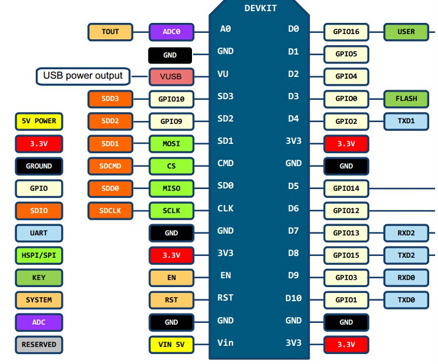

Pinout
======

Internal LED
~~~~~~~~~~~~
The internal LED is attached to GPIO2, which is pin D4

Boot mode
~~~~~~~~~
To boot properly, GPIO0 (D3) and GPIO2 (D4) must be :code:`HIGH`, and 
GPIO15 (D8) must be :code:`LOW`. Pull those pins with a 3.3K resistor.

The Lolin ESP12E NodeMCU Dev Kit already has those resistors.

Using GPIO0, GPIO2 and GPIO15 as outputs
~~~~~~~~~~~~~~~~~~~~~~~~~~~~~~~~~~~~~~~~
As noted above, these pins will already have a resistor connected to 
either VCC (GPIO0 and GPIO2) or GND (GPIO15). This determines how any 
external device, like a relay or led and resistor, must be connected. 

* For GPIO0 and GPIO2, an external load must be connected between VCC 
  and the pin so that it does not interfere with the action of the pull
  up resistor.
* Conversely an external load connected to GPIO15 must be connected 
  between GND and the pin so that is does not interfere with the action 
  of the pull down resistor. 

To activate the external device, GPIO0 or GPIO2 must be driven 
:code:`LOW` (inverted logic), while GPIO15 must be driven HIGH. 

Using GPIO0, GPIO2 and GPIO15 as inputs
~~~~~~~~~~~~~~~~~~~~~~~~~~~~~~~~~~~~~~~
As noted above on power up, and during reset, these pins must be pulled 
up or down as required to have the ESP8266 module start up in normal 
running mode. This means, in general, you cannot just attach an 
external switch to the these pins because at power up you usually 
cannot guarantee the switch will not be pulling the input to ground and 
so prevent the module from starting correctly.

There are solutions to do this, but you are better off not using those 
pins as inputs. See `Using ESP8266 GPIO0/GPIO2/GPIO15 pins 
<https://www.forward.com.au/pfod/ESP8266/GPIOpins/index.html>`_ if you 
really need to. 

Flash GPIO pins – GPIO6 to GPIO11
~~~~~~~~~~~~~~~~~~~~~~~~~~~~~~~~~
Most ESP8266 boards have a flash chip connected to some or all of 
GPIO6-GPIO11. Most programs use flash memory, as well as RAM, so unless 
you specifically make sure your code only runs from RAM, you can't use 
these pins for other purposes.

The exact number of pins used in the range GPIO6 to GPIO11 depends on 
the type of flash hardware used on your module. Quad IO uses 4 lines 
for data (6 pins total) for up to 4 times the speed of standard. Dual 
IO uses 2 lines for data (4 pins total) Standard uses a single line for 
data ( 3 pins total).

Unless you know exactly what your board requires, you are best to just 
ignore GPIO6 to GPIO11 and do not refer to them from your code.
