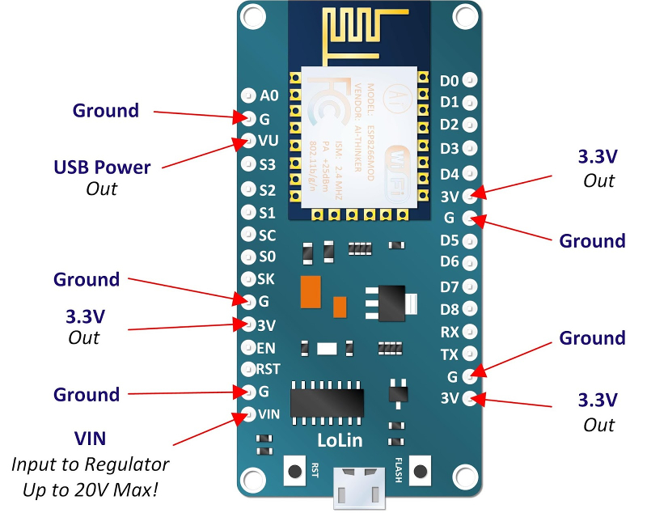

Power the Lolin ESP12E NodeMCU v3 dev kit
=========================================

3.3V pins
~~~~~~~~~
It has been reported that the 3.3V pins can be used as input too. This has not been verified at the time of writing.

Voltage regulator
~~~~~~~~~~~~~~~~~
It seems the voltage regulator on pin VIN is a NCP1117ST33T3G.

According to the `datasheet <http://www.onsemi.com/pub/Collateral/NCP1117-D.PDF>`_, this regulator :

* takes up to 20V on its input ;
* can supply over 1A at 3.3V ;
* has a 1.2V maximum dropout voltage ;
* has a quiescent current of less than 10mA (probably around 6mA).

Using batteries
~~~~~~~~~~~~~~~
This as not been tested at the time of writing.

Using 4x1.5V AA bettery, 6V can be provided to VIN.

A typical, low cost AA battery as a capacity of around 1000mAh. So 4 of them have 4000mAh. If the board is used to sample data from a sensor every few minutes, and then goes to deep sleep, it will roughly continuously draw 10mA. So 4000 divided by 10 gives us 400 hours.

.. warning:: this is only a theory, based on my understanding of how batteries work. Feel free to correct me if needed.

